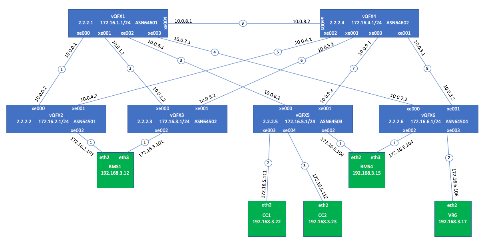

***
This Vagrantfile will spawn 6 instances of VQFX (Full) each with 1 Routing Engine and 1 PFE VM, along with 4 nodes connected to 2x4 vQFX Fabric.

# Topology 

## High Level Topology Diagram




# Provisioning / Configuration
If provisioning Contrail clusters via UI gets stuck, 

you may want to change the state of the contrail cluster so that UI goes back to a good state.
```bash
curl -i -k \
 -H "Content-Type: application/json" \
 -d '
{ "auth": {
   "identity": {
     "methods": ["password"],
     "password": {
       "user": {
         "name": "admin",
         "domain": { "id": "default" },
         "password": "contrail123"
       }
     }
   },
   "scope": {
     "project": {
       "name": "admin",
       "domain": { "id": "default" }
     }
   }
 }
}' \
 "https://localhost:9091/keystone/v3/auth/tokens" ; echo

curl --insecure \
  https://192.168.3.22:9091/contrail-clusters \
  -H 'Content-Type: application/json' \
  -H 'x-auth-token: 91350335-5b7b-4b21-b6a2-862f42ac541a' 


curl --insecure -X PUT \
  https://192.168.3.22:9091/contrail-cluster/92f8821a-22b7-45d5-97ce-9449fbe8d3d6 \
  -H 'Content-Type: application/json' \
  -H 'x-auth-token: 91350335-5b7b-4b21-b6a2-862f42ac541a' \
  -d '{
    "contrail-cluster": {
        "provisioning_state": "CREATED",
        "uuid": "92f8821a-22b7-45d5-97ce-9449fbe8d3d6"
    }
}'
```

## Provisioning Cluster via CLI
Instead of provisioning the Contrail cluster servers via Contrail Command, here is how to do it using the CLI.

Use the instances.yml checked into the scripts directory, and store it somewhere in the contrail_command docker.

First change contrail_configuration.CONTRAIL_VERSION in instances.yml

In this example, we stored it in /var/tmp/contrail_cluster/test1/instances.yml
```bash
# ssh into Contrail command VM
cd ~/cfm-vagrant/cfm-hitless
vagrant ssh cc1

# Get into contrail_command docker
sudo su
docker exec -it contrail_command bash

cd /usr/share/contrail/contrail-ansible-deployer

# For manual instances Installation use following command
ansible-playbook -i inventory/ -e orchestrator=openstack -e config_file=/var/tmp/contrail_cluster/test1/instances.yml playbooks/configure_instances.yml

# For manual OpenStack Installation use following command
ansible-playbook -i inventory/ -e orchestrator=openstack -e config_file=/var/tmp/contrail_cluster/test1/instances.yml playbooks/install_openstack.yml

# For manual Contrail Installation use following command
ansible-playbook -i inventory/ -e orchestrator=openstack -e config_file=/var/tmp/contrail_cluster/test1/instances.yml playbooks/install_contrail.yml
```

## Create New Contrail Command and Import Settings
If Contrail Command does not properly display settings after manually deploying above, 

here is how to create a new instance of Contrail Command and import settings.

In this example, we copied instances.yml and command_servers.yml from the repo scrips directory into /tmp in the Contrail Command VM.

Remember to change the version number in the "export CCD_IMAGE" line below.

Note that this will create a new docker called contrail_command_deployers, which in turn creates the contrail_command and contrail_mysql dockers.

When done, the contrail_command_deployers docker is removed.

```bash
# ssh into Contrail Command VM
cd ~/cfm-vagrant/cfm-hitless
vagrant ssh cc1

# First remove the existing contrail command dockers
docker rm -f contrail_command
docker rm -f contrail_mysql

# Remember to change the version number in the CCD_IMAGE line below as well as command_servers.server1.container_tag in command_servers.yml
export CCD_IMAGE=ci-repo.englab.juniper.net:5010/contrail-command-deployer:5.0-294
export COMMAND_SERVERS_FILE=/tmp/command_servers.yml
export INSTANCES_FILE=/tmp/instances.yml

docker run -t --net host -e orchestrator=openstack -e action=import_cluster -v $COMMAND_SERVERS_FILE:/command_servers.yml -v $INSTANCES_FILE:/instances.yml -d --privileged --name contrail_command_deployer $CCD_IMAGE
```

## BMS Multi-homing Configuration
In order to use multihoming for BMS1 and BMS4, you will need to patch the BMS servers with the following files in the cfm-hitless-1/sample-configs directory.
(Note that Vagrant doesn't seem to support bonding configuration from the Vagrantfile)
- ifcfg-eth2
- ifcfg-eth3
- ifcfg-bond0

Then do "sudo systemctl restart network" for them to take effect.

Here are some useful commands for debugging on the Centos BMS:
- cat /proc/net/bonding/bond0
- ip address
- ip route

You must use untagged interfaces on the BMS link because the Vagrant 82540EM NIC strips off tags.
This means the vQFXs also need to be configured with untagged interfaces on the multi-homing LAG interface.

See provided sample QFX configurations in cfg-hitless-1/sample-configs for reference.

NOTE: During development, I encountered some strange issues with the BMS Centos bond interfaces where LACP never got into the right state.
After doing "vagrant destroy" and "vagrant up" on the BMS VMs, and patching with the ifcfg files, the problem went away.
So, the moral of the story is, when in doubt destroy.

# Troubleshooting Tips

## Packet Sniffing

Want to sniff packets on virtualbox internal network fab2_vqfx2_seg2

```bash
fab-server# vagrant suspend bms1

fab-server# vboxmanage list vms

fab-server# vboxmanage showvminfo cfm-hitless-1_bms1_1538516534167_5794

(NIC 3:           MAC: 080027BE92D2, Attachment: Internal Network ‘fab2_vqfx2_seg2')

fab-server# vboxmanage modifyvm cfm-hitless-1_bms1_1538516534167_5794 --nictrace3 on --nictracefile3 /tmp/trace3.pcap

fab-server# vagrant resume bms1

fab-server# tcpdump -ttttnnr /tmp/trace3.pcap

When done, don't forget to turn tracing off or your pcap file will get very large and fill up your disk!

fab-server# vboxmanage modifyvm cfm-hitless-1_bms1_1538516534167_5794 --nictrace3 off
```


## Vbox Driver
After installing VirtualBox on the host "vboxdrv" kernel module is required to start bringing the VMs up via Vagrant. In case you see following error please reboot the host machine to make sure kernel module is loaded properly.


```bash
vagrant status
VirtualBox is complaining that the kernel module is not loaded. Please
run `VBoxManage --version` or open the VirtualBox GUI to see the error
message which should contain instructions on how to fix this error.

or

VBoxManage --version
WARNING: The vboxdrv kernel module is not loaded. Either there is no module
         available for the current kernel (3.10.0-862.el7.x86_64) or it failed to
         load. Please recompile the kernel module and install it by

           sudo /sbin/vboxconfig

         You will not be able to start VMs until this problem is fixed.
5.2.16r123759
 ```


## Useful Junos Commands
Here are some useful Junos commands for debugging multi-homing.

```bash
vagrant@vqfx2> show lacp interfaces 
Aggregated interface: ae118
    LACP state:       Role   Exp   Def  Dist  Col  Syn  Aggr  Timeout  Activity
      xe-0/0/2       Actor    No    No   Yes  Yes  Yes   Yes     Fast    Active
      xe-0/0/2     Partner    No    No   Yes  Yes  Yes   Yes     Fast    Active
    LACP protocol:        Receive State  Transmit State          Mux State 
      xe-0/0/2                  Current   Fast periodic Collecting distributing
 ```

```bash
vagrant@vqfx2> show ethernet-switching table 

MAC flags (S - static MAC, D - dynamic MAC, L - locally learned, P - Persistent static
           SE - statistics enabled, NM - non configured MAC, R - remote PE MAC, O - ovsdb MAC)


Ethernet switching table : 2 entries, 2 learned
Routing instance : default-switch
   Vlan                MAC                 MAC      Logical                Active
   name                address             flags    interface              source
   bd-5                08:00:27:42:0f:c9   DR       esi.1754               00:00:00:00:08:00:27:df:77:98 
   bd-5                08:00:27:4e:fd:73   DL       ae118.0              
 ```

```bash
vagrant@vqfx2> show vlans 

Routing instance        VLAN name             Tag          Interfaces
default-switch          bd-5                  NA       
                                                           ae118.0*
                                                           esi.1753*
                                                           esi.1754*
                                                           vtep.32769*
                                                           vtep.32770*
                                                           vtep.32771*
default-switch          default               1        
                                                           xe-0/0/3.0*
 ```

# Random Notes

- Multi-homing on this setup requires using untagged interfaces to the BMSs. In Contrail version 5.0-294 (both controller and UI) I encountered an issue
 where I could not configured an untagged vlan on the BMS instance. The VLAN field was required and entering vlan=0 did not result in sending any config to the devices.
 To work around this issue, I made this patch after configuring with another vlan ID:
 
```bash
delete groups __contrail_overlay_evpn_access__ interfaces ae118
set groups __contrail_overlay_evpn_access__ interfaces ae118 flexible-vlan-tagging
set groups __contrail_overlay_evpn_access__ interfaces ae118 native-vlan-id 4094
set groups __contrail_overlay_evpn_access__ interfaces ae118 mtu 9192
set groups __contrail_overlay_evpn_access__ interfaces ae118 encapsulation extended-vlan-bridge
set groups __contrail_overlay_evpn_access__ interfaces ae118 unit 0 vlan-id 4094

delete groups __contrail_overlay_evpn_access__ vlans bd-5
set groups __contrail_overlay_evpn_access__ vlans bd-5 interface ae118.0
set groups __contrail_overlay_evpn_access__ vlans bd-5 vxlan vni 5
 ```

- In trying to ping between bms1 and bms4, it didn't always work. "show ethernet-switching table" sometimes was missing
a MAC entry. We think there may be a QFX bug (Junos: 18.1R1.9 limited). To work around, we tried "clear ethernet-switching table"
as well as pinging in both directions. This seems to help.
