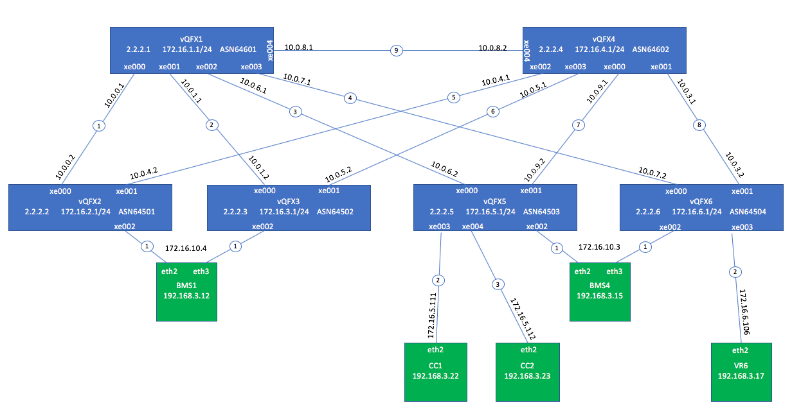

***
This Vagrantfile will spawn 6 instances of VQFX (Full) each with 1 Routing Engine and 1 PFE VM, along with 4 nodes connected to 2x4 vQFX Fabric.

# Topology 

## High Level Topology Diagram




# Provisioning / Configuration

Ansible is used to preconfigured both VQFX with an IP address on their interfaces


# Troubleshooting Tips

Want to sniff packets on virtualbox internal network fab2_vqfx2_seg2

```bash
fab-server# vagrant suspend bms1

fab-server# vboxmanage list vms

fab-server# vboxmanage showvminfo cfm-hitless-1_bms1_1538516534167_5794

(NIC 3:           MAC: 080027BE92D2, Attachment: Internal Network ‘fab2_vqfx2_seg2')

fab-server# vboxmanage modifyvm cfm-hitless-1_bms1_1538516534167_5794 --nictrace3 on --nictracefile3 trace3.pcap

fab-server# vagrant resume bms1

fab-server# tcpdump -ttttnnr trace3.pcap
```


After installing VirtualBox on the host "vboxdrv" kernel module is required to start bringing the VMs up via Vagrant. In case you see following error please reboot the host machine to make sure kernel module is loaded properly.


```bash
vagrant status
VirtualBox is complaining that the kernel module is not loaded. Please
run `VBoxManage --version` or open the VirtualBox GUI to see the error
message which should contain instructions on how to fix this error.

or

VBoxManage --version
WARNING: The vboxdrv kernel module is not loaded. Either there is no module
         available for the current kernel (3.10.0-862.el7.x86_64) or it failed to
         load. Please recompile the kernel module and install it by

           sudo /sbin/vboxconfig

         You will not be able to start VMs until this problem is fixed.
5.2.16r123759
 ```

